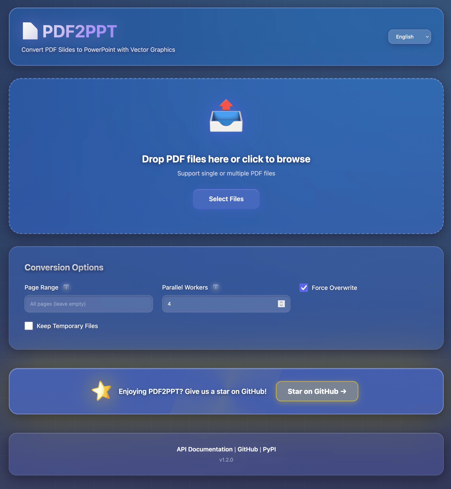

[English](README.md) | [简体中文](README_CN.md) | [繁體中文](README_TW.md) | [日本語](README_JP.md)

# pdf2ppt

[](https://badge.fury.io/py/pdfslides2ppt)
[](https://pypi.org/project/pdfslides2ppt/)
[](https://opensource.org/licenses/MIT)
[](https://github.com/neosun100/pdf2ppt/stargazers)

將 PDF 簡報轉換為 PowerPoint 演示文稿，使用**向量圖形**保持最高解析度。



## ✨ 功能特性

- 🎯 **向量圖形** - 生成的 PPT 保持最高解析度
- 📝 **元數據轉換** - 保留標題、作者等元數據
- 📐 **自動檢測** - 自動檢測簡報尺寸和寬高比
- 🚀 **簡單易用** - 簡潔的命令列介面，美觀的輸出
- 📄 **頁面選擇** - 使用 `--pages` 選項轉換指定頁面
- ⚡ **並行處理** - 使用 `--parallel` 選項加速轉換
- 🔍 **依賴檢查** - 自動檢查所需工具是否已安裝

## 🎯 使用場景

- **LaTeX** 使用者可以輕鬆將 [`beamer`](https://ctan.org/pkg/beamer) 簡報從 PDF 轉換為 PPT
- **Typst** 使用者可以輕鬆將 [`touying`](https://typst.app/universe/package/touying/) 簡報從 PDF 轉換為 PPT

## 🚀 快速開始

### 方式一：命令列工具 (pipx)

```bash
# 使用 pipx 安裝（推薦）
pipx install pdfslides2ppt

# 轉換 PDF 到 PPT
pdf2ppt input.pdf output.pptx
```

### 方式二：Web 介面 (Docker)

**x86_64 / AMD64 架構（Linux 伺服器、Intel Mac）：**
```bash
docker run -d -p 8100:8100 neosun/pdf2ppt:1.2.0-amd64
```

**ARM64 架構（Apple Silicon Mac、ARM 伺服器）：**
```bash
docker run -d -p 8100:8100 neosun/pdf2ppt:1.2.0-arm64
```

**自動檢測架構：**
```bash
docker run -d -p 8100:8100 neosun/pdf2ppt:latest
```

**訪問地址：** http://localhost:8100

### 方式三：API 伺服器

```bash
# 安裝伺服器依賴
pip install "pdfslides2ppt[server]"

# 啟動伺服器
python -m uvicorn web.app:app --host 0.0.0.0 --port 8100
```

**API 文件：** http://localhost:8100/docs

## 📦 安裝

### 前置條件

- **Python >= 3.9**
- [**pdf2svg**](https://github.com/dawbarton/pdf2svg) - 用於 PDF 轉 SVG
- [**Inkscape**](https://inkscape.org/) - 用於 SVG 轉 EMF

### 安裝依賴

**macOS:**
```bash
brew install pdf2svg inkscape
```

**Ubuntu/Debian:**
```bash
sudo apt-get install pdf2svg inkscape
```

**Windows:**
- 下載並安裝 [pdf2svg](https://github.com/dawbarton/pdf2svg) 和 [Inkscape](https://inkscape.org/)
- 將它們添加到系統 PATH

### 安裝 pdf2ppt

```bash
# 推薦：使用 pipx 安裝（隔離環境）
pipx install pdfslides2ppt

# 或使用 pip 安裝
pip install pdfslides2ppt
```

## 📖 使用方法

### 基本用法

```bash
# 指定輸出檔案
pdf2ppt input.pdf output.pptx

# 自動生成輸出檔名（input.pptx）
pdf2ppt input.pdf

# 詳細模式
pdf2ppt input.pdf --verbose
```

### 進階用法

```bash
# 轉換指定頁面
pdf2ppt input.pdf -p 1-5,7,9-11

# 並行處理（4個工作執行緒）
pdf2ppt input.pdf -j 4

# 強制覆蓋已存在的檔案
pdf2ppt input.pdf output.pptx --force

# 保留暫存檔案（用於除錯）
pdf2ppt input.pdf --no-clean
```

### 命令列選項

```
用法: pdf2ppt [-h] [-v] [--verbose] [--no-clean] [--no-check] [--force]
              [--pages PAGES] [--parallel PARALLEL]
              [--pdf2svg-path PATH] [--inkscape-path PATH]
              input [output]

位置參數:
  input                 輸入的 PDF 檔案
  output                輸出的 PPT 檔案（預設：input.pptx）

選項:
  -h, --help            顯示幫助資訊
  -v, --version         顯示版本號
  --verbose             詳細模式
  --no-clean            保留暫存檔案
  --no-check            跳過 SVG 濾鏡檢查
  --force, -f           強制覆蓋已存在的檔案
  --pages, -p PAGES     頁面範圍（如 "1-5,7,9-11"）
  --parallel, -j N      並行工作執行緒數（預設：1）
  --pdf2svg-path PATH   pdf2svg 可執行檔路徑
  --inkscape-path PATH  inkscape 可執行檔路徑
```

## 🔧 技術實現

1. 使用 `pdf2svg` 將 PDF 轉換為 SVG
2. 使用 `inkscape` 將 SVG 轉換為 EMF（由於 python-pptx 的限制）
3. 使用 `python-pptx` 將 EMF 插入 PPT

## 🛠️ 技術棧

| 組件 | 技術 |
|------|------|
| 語言 | Python 3.9+ |
| PDF 處理 | pypdf |
| PPT 生成 | python-pptx |
| PDF 轉 SVG | pdf2svg |
| SVG 轉 EMF | Inkscape |
| CLI 輸出 | rich |

## ⚠️ 已知問題

### 透明背景

由於依賴庫的限制，帶有透明度的元素可能無法完全支援。檢測到此類問題時會收到警告。您可以手動複製生成的 SVG 來修復問題。

詳見 [#1](https://github.com/neosun100/pdf2ppt/issues/1)。

## 🤝 貢獻

歡迎貢獻！請隨時提交 Pull Request。

1. Fork 本倉庫
2. 創建功能分支 (`git checkout -b feature/AmazingFeature`)
3. 提交更改 (`git commit -m 'Add some AmazingFeature'`)
4. 推送到分支 (`git push origin feature/AmazingFeature`)
5. 打開 Pull Request

## 📄 授權條款

本專案採用 MIT 授權條款 - 詳見 [LICENSE](LICENSE) 檔案。

版權所有 © 2023-2024 Teddy van Jerry ([Wuqiong Zhao](https://wqzhao.org))

## ⭐ Star 歷史

[](https://star-history.com/#neosun100/pdf2ppt)

## 📱 關注公眾號


